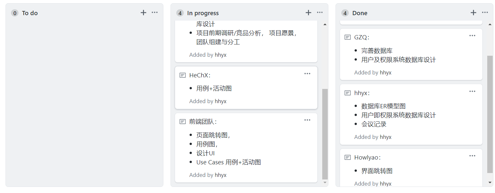
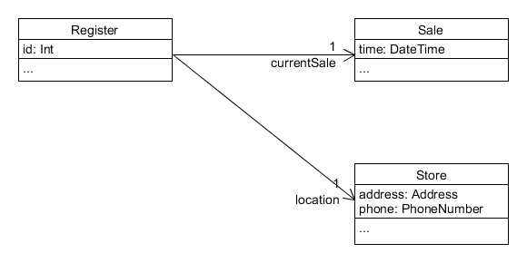

## 1. 简答题

### 用简短的语言给出对分析、设计的理解

- 分析：强调的是对问题和需求的调查研究，而不是解决方案。
- 设计：强调的是满足需求的概念上的解决方案，而不是其实现。

### 用一句话描述面向对象的分析与设计的优势

面向对象的分析与设计与语言无关，可以让不同领域的人使用统一的符号进行沟通，并且可以缩小分析与设计之间的鸿沟。

### 简述 UML（统一建模语言）的作用。考试考哪些图？

- 作用：UML是描述、构造和文档化系统制品的可视化语言，能够将分析与设计的结果可视化。
- 考试考的图：
  - 用例视图
    - 用例图
  - 设计视图
    - 类图
    - 对象图
  - 进程视图
    - 序列图
    - 协作图
    - 状态图
    - 活动图
  - 实现视图
    - 构件图
  - 拓扑视图
    - 部署图

### 从软件本质的角度，解释软件范围（需求）控制的可行性

由于软件本身的复杂性、不可见性、不一致性、可变性，在多数情况下，客户与开发者能就项目的 20% 内容给出严格的需求约定，80% 的内容都是相对模糊的。因此，围绕客户目标，发现并满足客户感兴趣的内容是最关键的。当与客户进行了全面的讨论协商，细化了20%的具体内容和有效需求后就能够满足客户80%的需求，从而有效控制软件需求。

## 2. 项目管理实践

### 看板使用练习（提交看板执行结果贴图，建议使用 Git project）

### UML绘图工具练习（提交贴图，必须使用 UMLet）请在 参考书2 或 教材 中选择一个类图（给出参考书页码图号）

选自 *UML和模式应用*  P184 图16-5