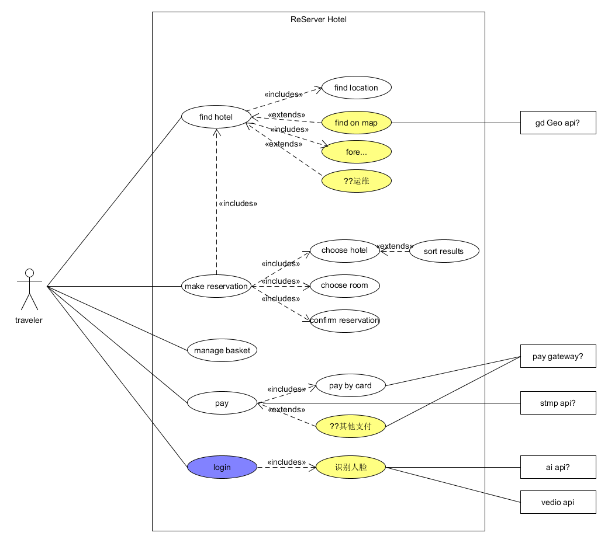
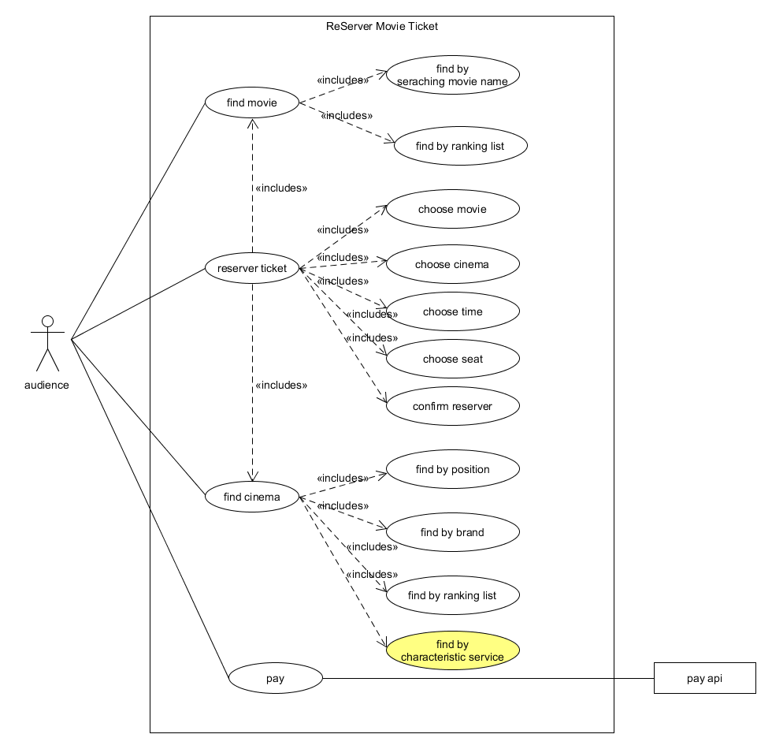

## 1. 简答题

### 1. 用例的概念

用例是一组相关的成功和失败场景集合，用来描述参与者如何使用系统来实现其目标。

### 2.用例和场景的关系？什么是主场景或 happy path？

- 场景是参与者和系统之间一系列特定的活动和交互，也称为用例实例。场景是使用系统的一个特定情节或用例的一条执行路径。用例就是一组相关的成功和失败场景集合。
- 主场景也被称为“理想路径”场景，它描述了满足涉众关注点的典型成功路径。

### 3.用例有哪些形式？

- 摘要（Brief）：简洁的一段式概要，通常用于主成功场景。
- 非正式（Casual）：非正式的段落格式，用几个段落覆盖不同场景。
- 详述（Fully）：详细编写所有步骤及各种变化，同时具有补充部分，如前置条件和成功保证。

### 4.对于复杂业务，为什么编制完整用例非常难？

复杂业务所涉及的场景非常多，较为复杂，要编制完整用例需要考虑很多因素，拓展部分较多。在整个用例编写过程中，理想路径与拓展场景相结合也只能尽可能满足大多数用户所关注的问题，而很难完成真正完整的用例。一些被遗漏的场景通常会在后期使用的过程中被发现，只有不断完善才有可能编写出完整用例。

### 5.什么是用例图？

用例图是一种优秀的系统语境图，能够展示系统边界、位于边界之外的事物以及系统如何被使用。用例图可以作为沟通的工具，用以概况系统及其参与者的行为。。

### 6.用例图的基本符号与元素？

- 参与者 (Actor)：用小人表示
- 用例 (Use Case)：用椭圆表示
- 包含关系 (Includes)：包含者指向被包含者的单箭头虚线
- 扩展关系 (Extends)：扩展者指向被扩展者的单箭头虚线
- 关联关系 (Association)：一条实线段

### 7.用例图的画法与步骤

   1. 确定系统边界
   2. 确定参与者
   3. 确定满足主要参与者目标的系统服务
   4. 建立关联

### 8.用例图给利益相关人与开发者的价值有哪些？
- 用例图能够帮助利益相关人明确需求，以及开发者理解需求。
- 用例图是项目参与者间交流的好工具。
- 用例图的画法是对现实世界的一种刻画，可以让项目参与者明白系统要做成什么样。

## 2.建模练习题（用例模型）
- 选择2-3个你熟悉的类似业务的在线服务系统（或移动 APP），如定旅馆（携程、去哪儿等）、定电影票、背单词APP等，分别绘制它们用例图。并满足以下要求：
  - 请使用用户的视角，描述用户目标或系统提供的服务
  - 粒度达到子用例级别，并用 include 和 exclude 关联它们
  - 请用色彩标注出你认为创新（区别于竞争对手的）用例或子用例
  - 尽可能识别外部系统和服务
  
  
  
  

- 然后，回答下列问题：
  1. 为什么相似系统的用例图是相似的？
  
     对于相似系统，用户需求是相似的，且用户使用系统的习惯是相似的，因此系统设计的用例是相似的、用例图中用户与用例之间的联系是相似的、用例与用例之间的关系也是相似的。
  
  2. 如果是定旅馆业务，请对比 Asg_RH 用例图，简述如何利用不同时代、不同地区产品的用例图，展现、突出创新业务和技术
  
      1. 可以使用各种地图api，使用户可以通过在地图上查询旅馆，选择满意的地点。
      2. 支付方式不再限于传统的信用卡，可以增加微信、支付宝等支付方式。
      3. 可以增加评论功能，使用户可以对旅馆的服务做出评价。
  
  3. 如何利用用例图定位创新思路（业务创新、或技术创新、或商业模式创新）在系统中的作用
  
     可以判断创新点在用例图的位置，与其他用例图的关系（如：作为某个用例扩展或包含的子用例），对该创新用例使用不同的颜色进行标记。把用例图看作一棵树，越靠近树根（用户），则该创新用例在系统中的作用越大。
  
  4. 请使用 SCRUM 方法，选择一个用例图，编制某定旅馆开发的需求（backlog）开发计划表
      | ID   | Name     | Imp  | Est  | How to demo                                                  | Notes                                                        |
     | ---- | -------- | ---- | ---- | ------------------------------------------------------------ | ------------------------------------------------------------ |
     | 1    | 登录     | 50   | 10   | 用户可以先注册好一个账号，输入账号及密码进行登录，或者利用微信等其他账号进行登录。 |                                                              |
     | 2    | 查找旅馆 | 80   | 20   | 用户在搜索界面输入地点、入住日期、退房日期等信息，点击搜索按键获得符合条件的旅馆列表。 | 选择地点可以通过键入地点、在列表中选择地点、在地图中选择地点等方式输入。 |
     | 3    | 预定旅馆 | 90   | 15   | 用户在查找好旅馆并选择好旅馆后，对该旅馆的房间进行选择，然后进行确认预定。 |                                                              |
     | 4    | 支付订单 | 100  | 25   | 用户在预定好旅馆后，选择某种支付方式对顶点进行支付。         | 支付方式包括微信、支付宝、银行卡等。                         |
  
  5. 根据任务4，参考 [使用用例点估算软件成本](https://www.ibm.com/developerworks/cn/rational/edge/09/mar09/collaris_dekker/index.html)，给出项目用例点的估算
  
     | 用例      | 事务 | 计算 | 原因    | UC权重 |
     | --------- | ---- | ---- | ------- | ------ |
     | 1登录     | 2    | 2    |         | 简单   |
     | 2查找旅馆 | 3    | 3    |         | 简单   |
     | 3预定旅馆 | 4    | 4    |         | 一般   |
     | 4支付订单 | 1    | 1    | 支付api | 简单   |
  